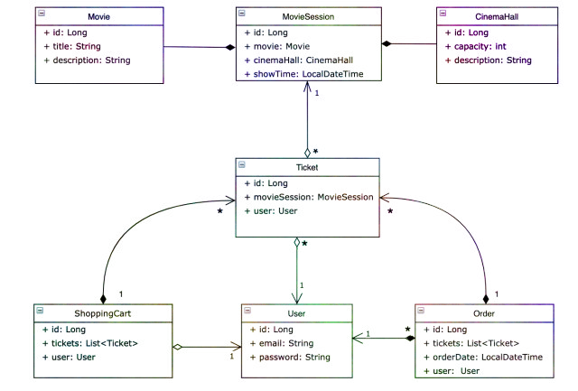

#  _My-Own-Cinema-Service_ 

 Description:

This project provides an example of how to create a WEB Application using Java Spring, Java Hibernate, JDBC, Tomcat and MySQL as a relational database. 
The basic functionality provides most common operations with objects such as Cinema Hall, Movie, Ticket, User, Shopping Cart, Order. 
REST API, and Basic Authentication allow using this application like endpoint third party applications for managing Cinema service. 
The app supports registration, authentication, authorization (that based to roles of users) and CRUD operations.

 Project structure:

- Data access tier -> handled by DAO;
- Business logic tier -> handled by Service;
- Presentation tier -> handled by Controllers.

 Technologies used:

- Java for service (I'm using version 17.0.3.1)
- IntelliJ IDEA (I'm using IntelliJ IDEA 2021.2.2 Ultimate Edition)
- Maven for service (I'm using version 3.8.6)
- JDBC for connection to DB
- MySQL as database (I'm using version 8.0.22)
- Apache Tomcat as web server (I'm using version 9.0.50)
- Hibernate (I'm using version 5.6.14.Final)
- Spring (I'm using version 5.3.20)

 How to launch the project on your PC:

- Download and install Intellij IDEA 2021.2.2 (Ultimate Edition)
- Download and install MySQLWorkbench version 8.0.31
- Download and install Tomcat 9.0.50
- Fork this project to your JDK
- Create new empty DB by MySQLWorkbench
- Configure db.properties file in project with data of your DB
- Add Tomcat server to configuration
- Click on debug icon to run project

 DataBase structure:

 Functionalities (access to endpoints by users roles):

- POST: /register - accessed for all users
- GET: /cinema-halls - accessed for all users with roles user and admin
- POST: /cinema-halls - accessed for all users with role admin
- GET: /movies - accessed for all users with roles user and admin
- POST: /movies - accessed for all users with role admin
- GET: /movie-sessions/available - accessed for all users with roles user and admin
- POST: /movie-sessions - accessed for all users with role admin
- PUT: /movie-sessions/{id} - accessed for all users with role admin
- DELETE: /movie-sessions/{id} - accessed for all users with role admin
- GET: /orders - accessed for all users with role user
- POST: /orders/complete - accessed for all users with role user
- PUT: /shopping-carts/movie-sessions - accessed for all users with role user
- GET: /shopping-carts/by-user - accessed for all users with role user
- GET: /users/by-email - accessed for all users with role admin